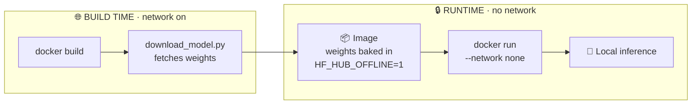

<div align="center">

# 🔒 Airlock

### Air-gapped Docker images for local LLMs

**One Dockerfile per well-known model. Weights baked in at build time. _Zero_ internet at runtime — like a sealed chamber for your model.**

[](https://github.com/dante0747/AirLock/actions/workflows/docker-build.yml)
[](LICENSE)
[](#-available-models)
[](#-security-model)
[](#%EF%B8%8F-cicd)

<a href="#-quick-start"><b>Quick start</b></a> ·
<a href="#-available-models"><b>Models</b></a> ·
<a href="#-security-model"><b>Security</b></a> ·
<a href="#%EF%B8%8F-cicd"><b>CI/CD</b></a> ·
<a href="CONTRIBUTING.md"><b>Contributing</b></a>

</div>

---

**Airlock** is a template repository for hosting **one Dockerfile per well-known
local LLM**, where every model runs in a **fully network-isolated** (air-gapped)
container. Each image bakes its model weights in at build time and is designed to
run with **no internet access**. Ideal for sensitive prompts, regulated
environments, or anywhere *"the model must not phone home"* is a hard requirement.

> [!NOTE]
> This repo is configured for **[`dante0747/AirLock`](https://github.com/dante0747/AirLock)** —
> images publish to `ghcr.io/dante0747/airlock-<model>`. "Airlock" is just the
> project name; rename the repo and the `airlock-*` image prefix to whatever you
> like.

## ✨ Why Airlock?

|  | |
|---|---|
| 🔌 **Truly offline** | Three independent layers (baked weights, library offline mode, kernel-level `--network none`) keep the model from ever reaching the internet. |
| 📦 **Self-contained** | Weights ship *inside* the image. Pull once, run anywhere — no Hub access, no surprises at runtime. |
| 🧩 **One folder per model** | Adding a model is just a directory + one line in the CI matrix. 17 models ready out of the box. |
| 🔐 **Secrets-safe** | Gated-model tokens are passed as **BuildKit secrets**, never baked into a layer or `docker history`. |
| 🤖 **Hands-off CI/CD** | GitHub Actions builds every model in parallel and publishes to `ghcr.io` with the built-in `GITHUB_TOKEN`. |

## 🔭 How it works



## 📁 Repository structure

```
.
├── <model>/                # one directory per model, named after the model
│   ├── Dockerfile          # builds the offline image (see comments inside)
│   ├── download_model.py   # bakes weights into the image at BUILD time
│   ├── serve.py            # tiny offline HTTP inference server (stdlib only)
│   ├── requirements.txt
│   └── README.md           # per-model build / run / pull / security docs
├── docker-images/          # docs & catalog for the pre-built ghcr.io images
│   └── README.md
├── .github/workflows/
│   └── docker-build.yml    # CI/CD: build every model, tag, and push to ghcr.io
├── CONTRIBUTING.md         # how to add a new model or improve an existing one
├── LICENSE
└── README.md               # you are here
```

Each model lives in its **own directory named after the model**, so adding a new
one is just adding a folder + one line in the CI matrix (see
[CONTRIBUTING.md](CONTRIBUTING.md)).

## 🧠 Available models

**17 models out of the box.** Gated models need a HuggingFace token; everything
else builds with zero credentials.

| # | Model | Directory | Default weights | Gated? | Image (`ghcr.io/dante0747/…`) |
|---|-------|-----------|-----------------|:------:|------------------|
| 1 | 🤖 GPT-2 | [`/gpt2`](gpt2/README.md) | `gpt2` | — | `airlock-gpt2` |
| 2 | 🦙 Llama | [`/llama`](llama/README.md) | `TinyLlama/TinyLlama-1.1B-Chat-v1.0` | — | `airlock-llama` |
| 3 | 🌬️ Mistral | [`/mistral`](mistral/README.md) | `mistralai/Mistral-7B-Instruct-v0.2` | 🔑 | `airlock-mistral` |
| 4 | 💎 Gemma 2 | [`/gemma`](gemma/README.md) | `google/gemma-2-2b-it` | 🔑 | `airlock-gemma` |
| 5 | 🔬 Phi-2 | [`/phi`](phi/README.md) | `microsoft/phi-2` | — | `airlock-phi` |
| 6 | 🌏 Qwen2.5 | [`/qwen`](qwen/README.md) | `Qwen/Qwen2.5-0.5B-Instruct` | — | `airlock-qwen` |
| 7 | 🦅 Falcon3 | [`/falcon`](falcon/README.md) | `tiiuae/Falcon3-1B-Instruct` | — | `airlock-falcon` |
| 8 | 🌸 BLOOM | [`/bloom`](bloom/README.md) | `bigscience/bloom-560m` | — | `airlock-bloom` |
| 9 | 🔮 Pythia | [`/pythia`](pythia/README.md) | `EleutherAI/pythia-410m` | — | `airlock-pythia` |
| 10 | ⚖️ StableLM 2 | [`/stablelm`](stablelm/README.md) | `stabilityai/stablelm-2-1_6b` | 🔑 | `airlock-stablelm` |
| 11 | 📂 OPT | [`/opt`](opt/README.md) | `facebook/opt-1.3b` | — | `airlock-opt` |
| 12 | 🧬 GPT-Neo | [`/gptneo`](gptneo/README.md) | `EleutherAI/gpt-neo-1.3B` | — | `airlock-gptneo` |
| 13 | 💻 DeepSeek Coder | [`/deepseek`](deepseek/README.md) | `deepseek-ai/deepseek-coder-1.3b-instruct` | — | `airlock-deepseek` |
| 14 | 🤏 SmolLM2 | [`/smollm`](smollm/README.md) | `HuggingFaceTB/SmolLM2-360M-Instruct` | — | `airlock-smollm` |
| 15 | 🍃 Zephyr | [`/zephyr`](zephyr/README.md) | `HuggingFaceH4/zephyr-7b-beta` | — | `airlock-zephyr` |
| 16 | 🔭 OLMo 2 | [`/olmo`](olmo/README.md) | `allenai/OLMo-2-0425-1B-Instruct` | — | `airlock-olmo` |
| 17 | ⚡ GLM-Edge | [`/glm`](glm/README.md) | `zai-org/glm-edge-1.5b-chat` | — | `airlock-glm` |

Every image is published at **`ghcr.io/dante0747/airlock-<model>`** — see
[`/docker-images`](docker-images/README.md#-full-image-paths) for the full,
copy-paste-ready list of all 17 paths.

> [!NOTE]
> 🔑 = gated. Gated directories default to a gated model, so their CI build needs
> an `HF_TOKEN` secret (the rest stay green without one). You can always point any
> directory at a different model with `--build-arg MODEL_ID=...`.

## 🚀 Quick start

```bash
# Build the reference model (open weights, no credentials required)
docker build -t airlock-gpt2 ./gpt2

# Run it fully air-gapped — the container has NO network interface at all
docker run -d --name gpt2 --network none airlock-gpt2

# Generate text from inside the isolated container
docker exec gpt2 python -c "import serve; print(serve.generate('Hello, world.', 40))"
```

Prefer an HTTP API? Use a Docker **internal** network (no internet egress):

```bash
docker network create --internal llm-net
docker run -d --name gpt2 --network llm-net -p 8000:8000 airlock-gpt2
curl -s localhost:8000/generate -H 'Content-Type: application/json' \
  -d '{"prompt": "The future of AI is", "max_new_tokens": 40}'
```

> [!TIP]
> Every model directory has its own README with full build/run/pull instructions.

## 🔐 Security model

Airlock's core guarantee: **the model never has internet access at runtime.**
That is enforced by three independent layers, so no single misconfiguration
breaks isolation:

| Layer | Mechanism | Effect |
|:-----:|-----------|--------|
| 1️⃣ **Weights baked at build time** | `download_model.py` runs *inside* `docker build`, caching all weights into the image. | At runtime there is nothing left to download. (The network is used **only** during the build.) |
| 2️⃣ **Library-level offline mode** | Every image sets `HF_HUB_OFFLINE=1` and `TRANSFORMERS_OFFLINE=1`. | The HuggingFace stack refuses to contact the Hub even if some code path tries to. |
| 3️⃣ **Kernel-level network isolation** | Images are designed to run with `docker run --network none`. | The container is given **no network interface**, so it physically cannot reach the internet (or your LAN). |

**Additional hardening:**

- 🧑‍💻 **Non-root runtime.** Each image creates and runs as an unprivileged
  `appuser`.
- 🤫 **Secrets stay out of images.** HuggingFace tokens for gated models are
  passed as **BuildKit secrets** (`--mount=type=secret`), never as `ENV`/`ARG`,
  so they never land in an image layer or `docker history`.

> [!IMPORTANT]
> **Why this matters:** local LLM weights and the prompts you send them are often
> sensitive. Air-gapping the container guarantees that prompts and outputs can't
> be exfiltrated, and that a compromised dependency inside the image can't "phone
> home."

### Verify the isolation yourself

```bash
docker run -d --name gpt2 --network none airlock-gpt2
# This MUST fail — there is no network interface in the container:
docker exec gpt2 python -c "import socket; socket.create_connection(('huggingface.co', 443), 5)" \
  && echo 'LEAK: had network!' || echo 'OK: no network'
```

### A note on `--network none` vs. exposing ports

These two goals are in tension, and the per-model READMEs are explicit about it:

| Mode | Internet access | How you talk to the model |
|------|-----------------|---------------------------|
| `--network none` (max isolation) | 🔒 **None** | `docker exec` or mounted volumes |
| `--network <internal-net>` | 🔒 **None** (egress blocked) | published port `8000` on that network |
| default bridge | ⚠️ **Yes** | published port `8000` |

> [!WARNING]
> `EXPOSE 8000` in the Dockerfiles is documentation only — it does nothing under
> `--network none`. Choose the row that matches your threat model.

## ⚙️ CI/CD

GitHub Actions ([`.github/workflows/docker-build.yml`](.github/workflows/docker-build.yml))
builds **every** model image and pushes them to the GitHub Container Registry
(`ghcr.io`):

- 🔁 **Triggers:** every push to `main`, every pull request (build-only, no
  push), a **daily schedule** (`03:00 UTC`), and manual `workflow_dispatch`.
- 🧱 **Matrix build:** all 17 models build in parallel (`fail-fast: false`, so a
  gated model missing its token won't sink the rest).
- 🏷️ **Tags:** each image is pushed as `:latest`, `:YYYYMMDD`, and `:<git-sha>`.
- 🔑 **Credentials:** publishing uses the built-in `GITHUB_TOKEN` — **no personal
  registry secrets required**. The workflow just needs `packages: write`
  permission (already set). The optional `HF_TOKEN` secret unlocks gated models.

The CI status badge at the top of this README reflects the latest run.

### GitHub secrets

Publishing to `ghcr.io` uses the built-in `GITHUB_TOKEN`, so **no Docker
registry secrets are needed**. The only (optional) secret is:

| Secret | Required | Purpose |
|--------|:--------:|---------|
| `HF_TOKEN` | optional | HuggingFace token for gated models (Mistral, Gemma, StableLM, official Llama) |

Set it under **Settings → Secrets and variables → Actions → New repository
secret**.

> [!NOTE]
> New ghcr.io packages are **private** by default. After the first push, set a
> package to **Public** (repo → Packages → the image → Package settings) if you
> want it pullable without authentication.

## 🤝 Contributing

New models and improvements are welcome — see [CONTRIBUTING.md](CONTRIBUTING.md)
for the directory convention, Dockerfile checklist, and PR process. Adding a
model is: copy a directory, set its `MODEL_ID`, add it to the CI matrix, done.

## 📄 License

[MIT](LICENSE) for the tooling in this repo. Note that the **model weights**
themselves carry their own licenses (e.g. Llama, Mistral, Gemma, and StableLM are
gated and may restrict redistribution) — you are responsible for complying with
them.
